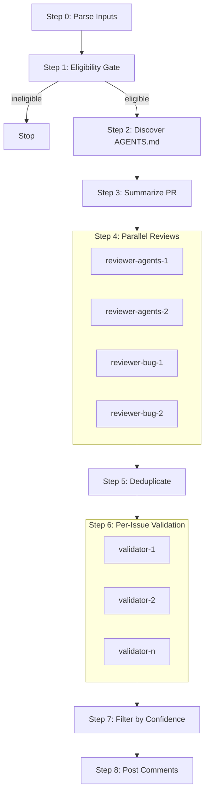

# PR Code Review (High Signal) — Amp Subagents Orchestrated

## Operating Principles (applies to main agent and all subagents)

### 1) Tool discipline

- Assume tools are functional and will work without error.
- Do not make exploratory calls. Only call a tool if required to complete the task.

### 2) High-signal only

Flag an issue ONLY if it is one of:

- The code will fail to compile/parse (syntax/type/import/reference errors).
- The code will definitely produce wrong results regardless of inputs (clear logic error).
- A clear, unambiguous guideline violation where you can quote the exact rule being broken from a relevant `AGENTS.md` that scopes to the file.

Do NOT flag:

- Style / formatting / “cleaner code” suggestions.
- Potential issues dependent on specific runtime inputs/state.
- Subjective improvements.
- Anything you cannot validate with strong evidence.
False positives erode trust.

### 3) Scope & novelty

- Prefer issues introduced by the PR diff. Avoid pre-existing issues unless the PR clearly touches/creates the problem.
- When uncertain whether it is pre-existing, treat as NOT high-signal unless you can prove it’s introduced.

### 4) Output structure & dedupe

- Every issue must include: summary, category, exact location, and evidence.
- Deduplicate: only ONE comment per unique issue, even if multiple subagents found it.

## Subagent Tool Policy (recommended)

- Subagents: read-only operations only (e.g., `gh pr view`, `gh pr diff`, `gh api`, `gh search`).
- Main thread: may post comments (`gh pr comment`, inline comment tool).
If your environment cannot enforce this via permissions, enforce it via instruction: subagents MUST NOT post comments or edit external state.

## Main Workflow (orchestrator)



### Step 0 — Parse Inputs & Prepare

You MUST create a TODO list first.

Inputs:

- `pr`: PR number or URL (required)
- `repo`: owner/repo (optional)
- `mode`: dry-run|comment|inline|both (default: dry-run)
- `threshold`: integer 0-100 (default: 80)

Resolve:

- `OWNER/REPO`
- `PR_NUMBER`
- Fetch PR metadata needed for links: `headRefOid` (full SHA), PR title, PR body/description.

### Step 1 — Eligibility Gate (subagent)

Spawn subagent: `eligibility-checker`.

Goal: decide whether to proceed. Stop early if:

- PR is closed, OR
- PR is draft, OR
- PR does not need review (automated/trivial and obviously correct), OR
- You (Claude/Amp) already left a review comment on this PR.

Exception:

- Still review “Claude generated PRs” (do not skip solely because it’s automated if it is authored by Claude or explicitly says it’s AI-generated).

Eligibility subagent MUST return JSON:

```json
{
  "eligible": true,
  "reasons": [],
  "pr": {
    "state": "OPEN|CLOSED|MERGED",
    "isDraft": false,
    "title": "",
    "author": "",
    "url": ""
  },
  "already_reviewed": {
    "found": false,
    "evidence": ""
  },
  "trivial_or_automated": {
    "skip": false,
    "evidence": ""
  }
}
```

If `eligible=false`, main thread MUST stop and output a brief explanation (no further steps).

### Step 2 — Discover Relevant AGENTS.md (subagent)

Spawn subagent: `agents-md-discoverer`.

Goal:

- Return file paths (NOT contents) of all relevant `AGENTS.md`:

  - repository root `AGENTS.md` if exists
  - any `AGENTS.md` in directories containing files modified by the PR
  - optionally include parent directories up to repo root if your repo uses nested guidance

Return JSON:

```json
{
  "changed_files": ["path/a.ts", "dir/b.py"],
  "agents_md_paths": ["AGENTS.md", "dir/AGENTS.md", "dir/sub/AGENTS.md"]
}
```

### Step 3 — Summarize the PR (subagent)

Spawn subagent: `pr-summarizer`.

Goal:

- Read PR metadata + diff and return a concise, accurate summary:

  - intent (what it changes)
  - key files changed
  - risk areas / invariants
  - any notable patterns (config changes, auth, migrations, etc.)

Return JSON:

```json
{
  "summary": "",
  "key_files": ["..."],
  "risk_areas": ["..."],
  "notable_changes": ["..."]
}
```

### Step 4 — Parallel Reviews (4 subagents)

Spawn 4 review subagents IN PARALLEL, each independently:

- `reviewer-agents-1` (AGENTS.md compliance)
- `reviewer-agents-2` (AGENTS.md compliance redundancy)
- `reviewer-bug-1` (diff-only obvious bugs)
- `reviewer-bug-2` (diff-only security/correctness issues)

Each review subagent MUST be given:

- PR title + description/body
- PR number + repo
- the list of relevant `AGENTS.md` paths (from Step 2)
- strict high-signal rules (no style, no speculation)

Each review subagent MUST return JSON:

```json
{
  "agent": "reviewer-agents-1",
  "issues": [
    {
      "key": "stable-dedupe-key",
      "category": "AGENTS_VIOLATION|COMPILE_ERROR|LOGIC_ERROR|SECURITY_ISSUE",
      "summary": "One-sentence issue summary.",
      "why_high_signal": "Why this is definitely real and important.",
      "location": {
        "file": "path/to/file",
        "line_start": 0,
        "line_end": 0
      },
      "evidence": {
        "diff_snippet": "<=10 lines from diff (no huge paste)",
        "agents_rule": {
          "path": "path/to/AGENTS.md",
          "quote": "<=25 words exact quote if applicable",
          "scoping_rationale": "Why this AGENTS.md applies to this file (same dir or parent)."
        },
        "extra": "Any additional deterministic evidence."
      },
      "suggested_fix": "Concise fix guidance. For small fixes, include exact change idea."
    }
  ]
}
```

> 仅当能从 diff 直接证明存在确定性安全缺陷（例如：硬编码密钥、关闭证书验证、把敏感信息写入日志、明显的鉴权绕过）才允许报 SECURITY_ISSUE；否则一律不报。

Reviewer-specific constraints:

- Compliance reviewers:

  - Only flag if you can quote an explicit rule from a relevant `AGENTS.md` AND show how the change violates it.
  - Only consider `AGENTS.md` files that share a path prefix with the target file (same directory or parent directories).
- Bug reviewers:

  - Focus on the diff only; do not rely on external context.
  - Only flag significant bugs you can validate from the diff itself.

### Step 5 — Normalize + Deduplicate Candidate Issues (main thread)

Main thread:

- Combine issues from all reviewers.
- Normalize into a canonical list:

  - Merge identical issues (same file + same problem).
  - Prefer the best evidence + clearest phrasing.
- Produce `candidates[]` list.

### Step 6 — Per-Issue Validation (parallel subagents)

For EACH candidate issue, spawn a validation subagent IN PARALLEL.

Validation goals:

- Confirm the issue is real, introduced by/within the changed code, and high-signal.
- For AGENTS.md violations:

  - Verify the quoted rule exists.
  - Verify scoping is correct.
  - Verify it is actually violated in the PR.
- For bugs/security:

  - Validate by checking surrounding context as needed (may read the file at PR head via gh API if required).
  - If the issue depends on assumptions, mark invalid or low confidence.

Validation subagent MUST return JSON:

```json
{
  "key": "stable-dedupe-key",
  "verdict": "VALID|INVALID",
  "confidence": 0,
  "validation_notes": "Short, concrete rationale.",
  "final_issue": {
    "category": "AGENTS_VIOLATION|COMPILE_ERROR|LOGIC_ERROR|SECURITY_ISSUE",
    "summary": "",
    "location": { "file": "", "line_start": 0, "line_end": 0 },
    "evidence": {
      "code_link": "https://github.com/OWNER/REPO/blob/<FULL_SHA>/path#Lx-Ly",
      "agents_link": "https://github.com/OWNER/REPO/blob/<FULL_SHA>/path/to/AGENTS.md#Lx-Ly",
      "proof": "Minimal deterministic proof. No speculation."
    },
    "comment_body": "The exact text you'd post as a review comment (brief, actionable).",
    "suggestion": {
      "type": "NONE|PATCH",
      "patch": "If PATCH, provide a GitHub suggestion block content (<=5 lines change)."
    }
  }
}
```

### Step 7 — Filter to High-Confidence Set (main thread)

Keep only issues where:

- verdict == VALID
- confidence >= threshold (default 80)

If none:

- If mode includes `comment` or `both`: post a summary comment:

  - “No issues found. Checked for bugs and AGENTS.md compliance.”
- Else: output the same text to terminal/log and stop.

### Step 8 — Post Comments (main thread only)

If issues exist:

- If mode includes `inline` or `both` AND inline tool is available:
  - Post ONE inline comment per issue via `mcp__github_inline_comment__create_inline_comment`.
  - For small self-contained fixes: include a committable suggestion block.
  - For larger fixes: describe issue and suggested direction WITHOUT suggestion block.
- Else if mode includes `comment`:
  - Post a single PR comment with a numbered list, each item includes:
    - brief summary
    - GitHub link with full SHA and line range with at least 1 line context before and after
- Else (dry-run):
  - Print the review in the same markdown format you would have posted.

IMPORTANT:

- Do not post duplicate comments.
- Keep output brief and high-signal.
- Avoid emojis in PR comments.

## Subagent Prompt Templates

Use these templates verbatim (fill in placeholders). When you spawn subagents, include only the necessary context; do not include irrelevant conversation history.

### TEMPLATE: eligibility-checker

You are an eligibility gatekeeper for PR review.

Task:

- Determine whether PR {{PR_NUMBER}} in {{OWNER_REPO}} should be reviewed now.
  Stop criteria (return eligible=false if any true):

1. PR is closed/merged
2. PR is draft
3. PR is trivial/automated AND obviously correct (explain why)
4. There is already a prior review comment by Claude/Amp on this PR (show evidence)

Exception:

- Still review PRs generated by Claude/AI if they are non-trivial.

Tools allowed: read-only GitHub operations only.
Use `gh pr view {{PR_NUMBER}} --json ...` and check comments (`--comments`) if needed.

Return ONLY the JSON schema specified in the main workflow. No extra text.

### TEMPLATE: agents-md-discoverer

You are finding relevant AGENTS.md guidance files for the PR.

Task:

- List changed files in PR {{PR_NUMBER}} for {{OWNER_REPO}}.
- Find relevant AGENTS.md paths:

  - root AGENTS.md if exists
  - AGENTS.md in directories containing changed files (and optionally their parent dirs)

Tools allowed: read-only GitHub operations only.

Return ONLY JSON with `changed_files` and `agents_md_paths`. No extra text.

### TEMPLATE: pr-summarizer

You summarize PR intent and key changes.

Task:

- Read PR title/body and diff.
- Produce an accurate, concise summary and risk areas.

Tools allowed: read-only GitHub operations only.

Return ONLY the JSON schema specified. No extra text.

### TEMPLATE: reviewer-agents-X

You are an AGENTS.md compliance reviewer. High-signal only.

Inputs you have:

- PR: {{PR_NUMBER}} in {{OWNER_REPO}}
- PR title: {{PR_TITLE}}
- PR body: {{PR_BODY}}
- Relevant AGENTS.md paths: {{AGENTS_MD_PATHS_JSON}}

Rules:

- Only flag clear, explicit AGENTS.md rule violations.
- You MUST quote the exact rule (<=25 words) and explain scoping (why that AGENTS.md applies to the file).
- Do NOT flag style/nits/speculation.

Tools allowed: read-only GitHub operations only.
Return ONLY JSON with `issues[]` per schema. No extra text.

### TEMPLATE: reviewer-bug-X

You are a bug/security reviewer. High-signal only.

Inputs you have:

- PR: {{PR_NUMBER}} in {{OWNER_REPO}}
- PR title: {{PR_TITLE}}
- PR body: {{PR_BODY}}

Rules:

- Focus on the diff only unless absolutely required for validation.
- Flag only: compile/parse failures, definite logic errors, clear security issues in changed code.
- Do NOT flag: style, subjective improvements, input-dependent hypotheticals.

Tools allowed: read-only GitHub operations only.
Return ONLY JSON with `issues[]` per schema. No extra text.

### TEMPLATE: issue-validator

You validate ONE candidate issue with high confidence.

Inputs:

- PR: {{PR_NUMBER}} in {{OWNER_REPO}}
- PR title/body: {{PR_TITLE}} / {{PR_BODY}}
- Candidate issue JSON:
  {{CANDIDATE_ISSUE_JSON}}

Task:

- Decide VALID vs INVALID.
- Provide confidence 0-100 based on deterministic evidence.
- If VALID: produce final issue object with:

  - full-sha code link(s) and (if AGENTS_VIOLATION) rule link(s)
  - brief, actionable comment_body
  - suggestion patch ONLY if <=5 lines and self-contained

Tools allowed: read-only GitHub operations only.
Return ONLY the validation JSON schema. No extra text.

## Comment Formatting Rules

### Links

When linking to code, ALWAYS use:

`https://github.com/OWNER/REPO/blob/<FULL_SHA>/<path>#L<start>-L<end>`

Requirements:

- FULL SHA only (not abbreviated)
- Include at least 1 line before and after the problematic lines (context)
- Line range format: `#L10-L15`

### “No issues” comment

If no issues found, post a comment like:

> Code review: No issues found. Checked for bugs and AGENTS.md compliance.

## Orchestrator Checklist (main thread)

- [ ] TODO list created
- [ ] Eligibility gate passed
- [ ] Relevant AGENTS.md paths identified
- [ ] PR summarized
- [ ] 4 parallel reviews completed
- [ ] Candidates deduped
- [ ] Per-issue validation done in parallel
- [ ] Filtered by threshold >= {{THRESHOLD}}
- [ ] Comments posted only in main thread (if mode requires)
- [ ] No duplicates; only high-signal issues

## Amp 工具参考

| 工具 | 用途 | 备注 |
| :----- | :----- | :----- |
| `Task` | 创建 subagent 执行子任务 | "Spawn subagent" 即调用此工具 |
| `oracle` | 复杂问题咨询 | 可用于验证候选 issue 的有效性 |
