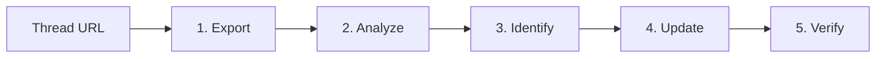

# Learning from Threads

从 Amp Thread 中提取知识并沉淀到 Skills/Docs。

## 知识来源

- **失败**：Agent 执行出错，暴露盲区
- **纠偏**：人类反馈修正理解
- **发现**：工具调用中获得的新信息
- **讨论**：多轮对话形成的洞察

## ⚠️ MANDATORY Workflow

> **必须按顺序执行这些步骤，不要跳过直接修改文件。**



### Step 1: Export Thread

```bash
# 用 Thread ID 命名，便于后续查询和关联
amp threads markdown T-xxx > /tmp/T-xxx.md
```

> **为什么不用 `read_thread` 工具？** 该工具输出 AI 摘要，依赖 goal 质量，可能丢失用户反馈细节。直接用 `amp threads markdown` 导出 + grep 更接近 ground truth。

### Step 2: Run Analysis Script

```bash
./scripts/main.sh /tmp/T-xxx.md
```

输出内容：

- Basic stats (turns, tool calls)
- **Failed tool calls** (exitCode != 0) - 最高价值信号
- Errors found in output
- Human feedback (filtered from Tool Results)
- Skills loaded

### Step 3: Identify Knowledge（必须先输出再继续）

Review analysis output，用表格列出发现：

```markdown
## Findings

| # | Type | Description | Target |
| --- | ------ | ------------- | -------- |
| 1 | Error → Fix | Missing error handling for empty response | spider2-troubleshoot SKILL.md |
| 2 | Human correction | "你为什么没用 thread skill" - should auto-load | learning-from-threads description |
| 3 | New pattern | ... | ... |
```

知识类型：

- **Error → Fix**: Agent 犯错后找到正确做法
- **Human correction**: 用户指出问题
- **New discovery**: 之前未覆盖的场景
- **Best practice**: 经验证有效的做法

### Step 4: Update Target

| 知识类型 | 沉淀位置 |
| :--------- | :--------- |
| 常见陷阱 | Skill 踩坑清单 |
| 正确做法 | Skill 示例代码 |
| 判断逻辑 | Skill Workflow |
| 项目约定 | AGENTS.md |
| 操作指南 | docs/ |

### Step 5: Verify（必须在新 Thread）

> **知识诅咒**：工具调用会污染当前 Context。执行 `amp threads markdown` 后，Agent 已"知道"内容；加载 Skill 后，Agent 行为已改变。此后无法再模拟"不知道"的状态。

**验证必须在新 Amp Thread 进行**（无历史 context）。可以用 `handoff` 工具创建新 Thread 继续验证。

## 分析工具

### Quick Analysis（推荐）

```bash
# Export + analyze in one command (用 Thread ID 命名)
amp threads markdown T-xxx > /tmp/T-xxx.md && \
  ./scripts/main.sh /tmp/T-xxx.md
```

### Manual Commands

```bash
# 预览
head -100 /tmp/T-xxx.md

# 搜索错误（带上下文）
rg -n -C3 "Error|error|Failed" /tmp/T-xxx.md

# 提取真正的人类反馈（过滤 Tool Result）
awk '/^## User/{getline; getline; if(!/Tool Result/) print NR": "$0}' /tmp/T-xxx.md

# 失败的工具调用（高价值信号）
rg -n '"exitCode": [^0]' /tmp/T-xxx.md

# Tool 调用及结果
rg -n -C5 "Tool Use:" /tmp/T-xxx.md
```

> **失败调用是高价值信号**：每次工具调用应最大化信息熵。失败调用不仅浪费 token，还会用无用上下文污染 context。分析失败原因并沉淀到技能中，避免重复踩坑。

### mq (markdown-query)

mq 是 Markdown 处理工具，类似 jq 处理 JSON。关键参数：

- `-A` 聚合模式（必须，用于过滤操作）
- `-F json` 输出 JSON 格式

```bash
# 提取所有 h2 标题（会话轮次）
mq '.h2' /tmp/T-xxx.md

# 统计 User/Assistant 轮次
mq -A -F json 'group_by(filter(., is_h2), to_text)' /tmp/T-xxx.md

# 提取所有代码块语言类型
mq '.code.lang' /tmp/T-xxx.md

# 筛选包含 Error 的代码块
mq '.code | select(contains("Error"))' /tmp/T-xxx.md

# 提取所有链接 URL
mq '.link.url' /tmp/T-xxx.md
```

### 技能遵循度分析

检查 Agent 是否遵循特定技能的规则：

```bash
# 列出所有 SQL 查询
rg -n "duckdb -c" /tmp/T-xxx.md

# 检查特定模式（如 COALESCE 用法）
rg -n "COALESCE.*stock" /tmp/T-xxx.md

# 检查目录读取方式
rg -n "FROM.*parquet" /tmp/T-xxx.md

# 对照技能踩坑清单逐条验证
```

## Anti-patterns

| ❌ 避免 | ✅ 应该 |
| :-------- | :-------- |
| 跳过步骤直接改文件 | 按 5 步走完整流程 |
| 只用 `read_thread` 工具 | 先用 `amp threads markdown` 导出完整内容 |
| 只看失败 | 关注所有知识来源 |
| 照搬具体案例 | 归纳为可复用模式 |
| 堆砌以防万一 | 只沉淀经验证的知识 |
| 在同一 Thread 验证 | 用 `handoff` 创建新 Thread 验证 |

## Amp 工具参考

| 工具 | 用途 | 备注 |
| :----- | :----- | :----- |
| `amp threads markdown T-xxx` | CLI 命令，导出完整对话 | Ground truth，用于深度分析 |
| `read_thread` | Agent 工具，读取并摘要 Thread | 依赖 goal 质量，可能丢失细节 |
| `find_thread` | Agent 工具，搜索 Threads | 支持 `file:`, `task:`, `cluster_of:`, `after:` 等过滤器 |
| `handoff` | Agent 工具，移交到新 Thread | 用于验证或继续长任务 |

## Notes

- 人类反馈往往是最有价值的信号，用 awk 命令过滤 Tool Result 后提取
- 一次只沉淀一个主题，便于追踪效果
